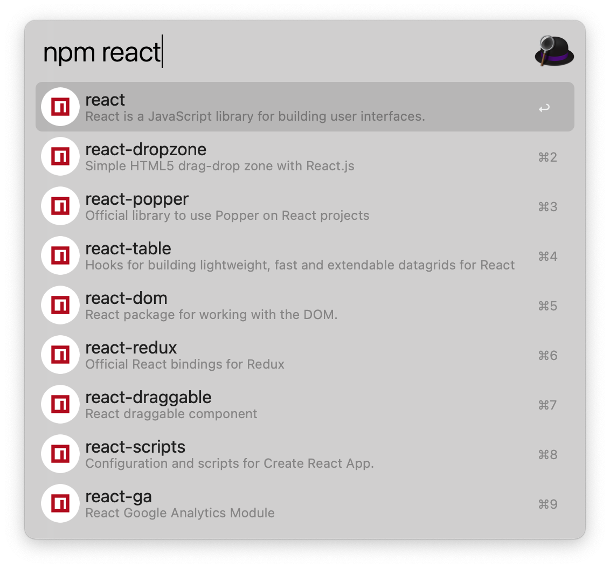

# alfred-workflow-npm-search

NPM Workflow for Alfred.

## Screenshots

## Tips

Select a package and press Enter to go to its npm page.

Hold Alt when pressing Enter to go to its GitHub repo.

Press Shift to view its readme in Quick Look.

## Reference

<https://github.com/sindresorhus/alfred-npms>
